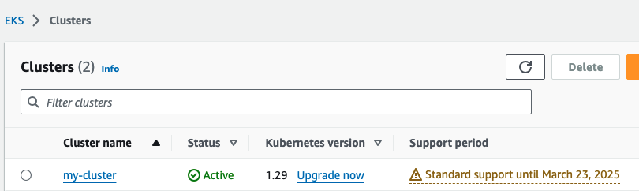
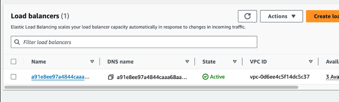

This project consists in 2 parts:

- Create the AWS EKS infra with Terraform 
- Sample Application Deployment

# Create the AWS EKS infra with Terraform 

Prerequisite: Terraform tool setup with aws credential configuration, kubectl tool, aws cli tool

## AWS Resources

The Terraform configuration provisions the following resources:

### VPC Configuration
- **CIDR Block**: `10.10.0.0/16`
- **Availability Zones**: `eu-central-1a`, `eu-central-1b`, `eu-central-1c`
- **Subnets**:
  - Private: `10.10.1.0/24`, `10.10.2.0/24`, `10.10.3.0/24`
  - Public: `10.10.101.0/24`, `10.10.102.0/24`, `10.10.103.0/24`
- **NAT Gateway**: Enabled
- **VPN Gateway**: Enabled
- **Tags**: 
  - `Environment`: `dev`
  - `Terraform`: `true`

### EKS Configuration
- **Cluster Name**: `my-cluster`
- **Kubernetes Version**: `1.29`
- **Public Endpoint Access**: Enabled
- **Add-ons**:
  - CoreDNS
  - Kube-proxy
  - VPC CNI (most recent versions)
- **Node Group**:
  - Managed Node Group: `example`
  - Instance Type: `t3.large`
  - Minimum Nodes: `2`
  - Maximum Nodes: `10`
  - Desired Size: `2`
- **Tags**: 
  - `Environment`: `dev`
  - `Terraform`: `true`


Notes about the configuration: 
- I used a region close to me (although technically should be a region close to the final user)
- I used Kubernetes version 1.29, which is still supported but not the latest one
- t3.large is probably overkill for this exercise but I erred on the side of safety rather than try to optimize cost

Steps:

1. Initialize Terraform

Run the following command to download the necessary providers and modules:

```
terraform init
```

2. Preview the changes

To preview the changes that Terraform will make, run:

```
terraform plan
```

3. Apply the configuration

Run the following command to apply the configuration and provision the resources:

```
terraform apply
```

You will be prompted to confirm. Type yes to proceed.

Note: Destroy the infrastructure

When you're finished and want to destroy the resources, run:

```
terraform destroy
```

 
 4.  To access your eks clutster, geneate the kubeconfig with below command

 ```
 aws eks update-kubeconfig --name my-cluster --region eu-central-1
 ```

See cluster created in AWS:





5. And here we go. You can start using the kubectl commands.
```
kubectl get pods
```


# Sample Wordpress Application Deployment with Helm

1. Install Helm

Helm is a package manager for Kubernetes, and it is used to deploy and manage applications on a Kubernetes cluster. You can install Helm by following the official Helm installation guide.

```bash
sudo yum install openssl -y
curl https://raw.githubusercontent.com/helm/helm/master/scripts/get-helm-3 > get_helm.sh
chmod 700 get_helm.sh
./get_helm.sh
```

2. Set Up EBS CSI addon for EKS
First, create an IAM OIDC provider for your cluster.

```bash
oidc_id=$(aws eks describe-cluster --name my-cluster --query "cluster.identity.oidc.issuer" --output text | cut -d '/' -f 5)
aws iam list-open-id-connect-providers | grep $oidc_id | cut -d "/" -f4
eksctl utils associate-iam-oidc-provider --cluster my-cluster --approve
```

Add IAM Role using eksctl

```bash
eksctl create iamserviceaccount \
--name ebs-csi-controller-sa \
--namespace kube-system \
--cluster my-cluster \
--attach-policy-arn arn:aws:iam::aws:policy/service-role/AmazonEBSCSIDriverPolicy \
--approve \
--role-only \
--role-name AmazonEKS_EBS_CSI_DriverRole
```

Then add EBS CSI to EKS by running the following command

```bash
eksctl create addon --name aws-ebs-csi-driver --cluster my-cluster --service-account-role-arn arn:aws:iam::111122223333:role/AmazonEKS_EBS_CSI_DriverRole --force
```

3. Install WordPress using Helm

Install the WordPress chart: To install the WordPress chart, run the following command:

```bash
helm repo add bitnami https://charts.bitnami.com/bitnami
```

Once the repo is added then we can install WordPress using the below command.

```bash
helm install my-wp2 oci://registry-1.docker.io/bitnamicharts/wordpress \
  --set service.type=LoadBalancer \
  --set service.annotations."service\.beta\.kubernetes\.io/aws-load-balancer-type"=nlb \
  --set wordpressUsername=admin \
  --set wordpressPassword=defaultpass \
  --set wordpressScheme=https
  ```

This will install the latest version of the WordPress chart from the official Bitnami repository.

The exercise requires that the app uses a database. This helm chart uses MariaDB as SQL database. It also has a in-memory database (Memcached).

A default user is created with the username “admin” and the password is set to “defaultpass”.


4. Horizontal pod auto scaler (HPA)
Creating a Horizontal Pod Autoscaler (HPA) for your deployment in Kubernetes, such as a WordPress deployment named my-release, involves using kubectl, the command-line tool for Kubernetes. Here’s a step-by-step guide to do this:

Metrics Server: The HPA feature requires the source of a metric, typically the Metrics Server in a Kubernetes cluster. Make sure it’s deployed in your cluster. You can install it via:

```bash
kubectl apply -f https://github.com/kubernetes-sigs/metrics-server/releases/latest/download/components.yaml
```

Creating HPA: Use the kubectl autoscale command to create an HPA. This command will create an HPA that automatically scales your deployment based on specified metrics like CPU or memory usage.

For example, to create an HPA for your my-release deployment that targets an average CPU usage of 50%, use:

```bash
kubectl autoscale deployment my-release --cpu-percent=50 --min=1 --max=10
```
In this command:

--cpu-percent=50 specifies the target average CPU utilization.
--min=1 specifies the minimum number of pods.
--max=10 specifies the maximum number of pods.
Verify HPA Creation: After creating the HPA, you can check its status using:

```bash
kubectl get hpa
```

It’s important to monitor the HPA to ensure it’s operating as expected. You can watch the HPA’s behavior over time with:

```bash
kubectl get hpa -w
```

5. Node Auto-scaling

 Achieving node autoscaling in AWS Elastic Kubernetes Service (EKS) is typically done using AWS Auto Scaling Groups (ASGs). Here’s how you can set it up.

 Enable EC2 Auto Scaling

In the AWS Management Console, navigate to the EC2 Auto Scaling section
Then select the auto scaling group which needs automatic scaling.
Then go to “Auto matic scaling” Tab and create a dynamic scaling policy.


Click the Create button to create the Dynamic Scaling policy.


6. SSL Setup

Setting up an SSL certificate for an AWS Classic Load Balancer involves a few steps, including obtaining a certificate, uploading it to AWS, and configuring the load balancer to use it. Here’s a general guide on how to do it:

Obtain an SSL Certificate

First, you need to have an SSL certificate. You can obtain an SSL certificate from a Certificate Authority (CA) like Let’s Encrypt, VeriSign, or any other trusted provider. AWS also provides AWS Certificate Manager (ACM), which can be used to create and manage SSL/TLS certificates.

Using AWS Certificate Manager (ACM)

- Request a Certificate: Go to ACM in the AWS Management Console and request a certificate. You will need to specify the domain names that you want to include in the certificate.
- Validate the Certificate: After requesting a certificate, you need to validate domain ownership. This can be done either through email validation or DNS validation.
- Certificate Issued: Once validated, ACM will issue the certificate.


Set up the Load Balancer

Open the EC2 Console: Go to the Amazon EC2 console.
Select Load Balancers: Under the “Load Balancing” section, select “Load Balancers”.
Choose Your Load Balancer: Select the Classic Load Balancer you want to configure.
Add an HTTPS Listener: In the Listeners configuration for your load balancer, add a new listener for HTTPS (port 443). The instance port chooses the HTTP port 31047


Select SSL Certificate: Choose the SSL certificate you uploaded to IAM or ACM.

Save: Save your configurations.

Update DNS Records
If needed, update your DNS records to point to the load balancer.


Access the WordPress site

After the installation, you can access the WordPress site using the URL provided by the output of the install command. Alternatively, you can go to EC2->Load Balancer and grab the Load Balancer URL from there.


We go to Load balancer in AWS and copy the DNS name in our browser:




This is the wordpress app:


